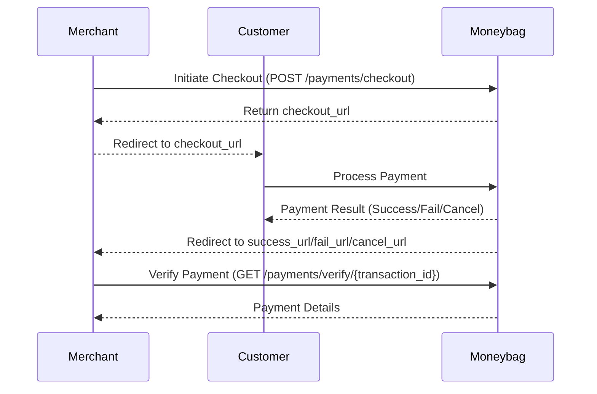

# Moneybag API Integration Guide

This document explains how merchants can integrate with the Moneybag payment system using the two primary endpoints: **Checkout** and **Verify**.

---

## Integration Flow

1. **Initiate Checkout:**  
   Call the `/payments/checkout` endpoint with order and customer details.
2. **Redirect Customer:**  
   Redirect the customer to the `checkout_url` to complete payment.
3. **Handle Callback:**  
   After payment, Moneybag will redirect the customer to your provided `success_url`, `fail_url`, or `cancel_url`.
4. **Verify Payment:**  
   Use the `/payments/verify/{transaction_id}` endpoint to confirm the payment status.

---

## Payment Flow (UML)

Below is a UML sequence diagram describing the payment flow between the merchant, customer, and Moneybag:


---


## Base URL

**Sndbox URL:**
`https://sandbox.api.moneybag.com.bd/api/v2`

---

## 1. Checkout Endpoint

**Endpoint:**  
`POST /payments/checkout`

**Purpose:**  
Initiate a payment session for a customer order. This returns a checkout URL where the customer can complete the payment.

**Headers:**
- `X-Merchant-API-Key: <your_merchant_api_key>`

**Request Body Example (`application/json`):**
```json
{
  "order_id": "order123321",
  "currency": "BDT",
  "order_amount": "1280.00",
  "order_description": "Online purchase of electronics",
  "success_url": "https://yourdomain.com/payment/success",
  "cancel_url": "https://yourdomain.com/payment/cancel",
  "fail_url": "https://yourdomain.com/payment/fail",
  "ipn_url": "https://yourdomain.com/payment/ipn",
  "customer": {
    "name": "John Doe",
    "email": "john.doe@example.com",
    "address": "123 Main Street",
    "city": "Dhaka",
    "postcode": "1000",
    "country": "Bangladesh",
    "phone": "+8801700000000"
  },
  "order_items": [
    {
      "sku": "PROD001",
      "product_name": "iPhone 15",
      "product_category": "Electronic",
      "quantity": 1,
      "unit_price": "1200.00",
      "vat": "120.00",
      "convenience_fee": "80.00",
      "discount_amount": "100.00",
      "net_amount": "1300.00"
    }
  ],
  "shipping": {
    "name": "John Doe",
    "address": "123 Main Street",
    "city": "Dhaka",
    "postcode": "1000",
    "country": "Bangladesh"
    },
  "metadata": {
    "source": "web",
    "session_id": "SESSION12345",
    "user_agent": "Mozilla/5.0",
    "ip_address": "192.168.1.1",
    "platform": "web"
  },
  "payment_info": {
    "is_recurring": false,
    "installments": 0,
    "currency_conversion": false,
    "allowed_payment_methods": ["card", "mobile_banking"],
    "requires_emi": false
  }
}
```

### Request Body Fields

| Field                | Type                | Required | Description                                                                                  | Constraints/Notes                                  |
|----------------------|---------------------|----------|----------------------------------------------------------------------------------------------|----------------------------------------------------|
| order_id             | string              | Yes      | Unique transaction ID to identify your order                                                 | Max 30 chars                                       |
| currency             | string              | Yes      | Three-letter currency code (e.g., BDT, USD, EUR)                                             | Must match `^[A-Z]{3}$`                            |
| order_amount         | decimal             | Yes      | Merchant order amount                                          | Max 2 decimal places                               |
| order_description    | string              | No       | Description of the order                                                                     |                                                    |
| success_url          | string (URL)        | Yes      | Callback URL after successful payment                                                        | Max 255 chars, must start with http/https          |
| cancel_url           | string (URL)        | Yes      | Callback URL if user cancels the transaction                                                 | Max 255 chars, must start with http/https          |
| fail_url             | string (URL)        | Yes      | Callback URL if payment failure occurs                                                       | Max 255 chars, must start with http/https          |
| ipn_url              | string (URL)        | No       | Instant Payment Notification URL                                                             | Must start with http/https                         |
| customer             | object (Customer)   | Yes      | Customer information (see below)                                                             |                                                    |
| shipping             | object (Shipping)   | No       | Shipping information (see below)                                                             |                                                    |
| order_items          | array of objects    | No       | List of items in the order (see below)                                                       |                                                    |
| payment_info         | object              | No       | Payment-related information (see below)                                                      |                                                    |
| metadata             | object              | No       | Additional order-specific data                                                               |                                                    |

#### Customer Object

| Field     | Type   | Required | Description                |
|-----------|--------|----------|----------------------------|
| name      | string | Yes      | Customer full name         |
| email     | string | Yes      | Customer email             |
| address   | string | Yes      | Customer address           |
| city      | string | Yes      | Customer city              |
| postcode  | string | Yes      | Customer postal code       |
| country   | string | Yes      | Customer country           |
| phone     | string | Yes      | Customer phone number      |

#### Shipping Object

| Field     | Type   | Required | Description                |
|-----------|--------|----------|----------------------------|
| name      | string | Yes      | Recipient's full name      |
| address   | string | Yes      | Shipping address           |
| city      | string | Yes      | Shipping city              |
| state     | string | No       | Shipping state/province    |
| postcode  | string | Yes      | Shipping postal code       |
| country   | string | Yes      | Shipping country           |
| metadata  | object | No       | Additional shipping data   |

#### OrderItem Object

| Field            | Type     | Required | Description                                  |
|------------------|----------|----------|----------------------------------------------|
| sku              | string   | No       | Product SKU                                  |
| product_name     | string   | No       | Product name                                 |
| product_category | string   | No       | Product category (e.g., Electronic, topup)   |
| quantity         | integer  | No       | Product quantity                             |
| unit_price       | decimal  | No       | Unit price of the product                    |
| vat              | decimal  | No       | VAT amount                                   |
| convenience_fee  | decimal  | No       | Convenience fee                              |
| discount_amount  | decimal  | No       | Discount amount                              |
| net_amount       | decimal  | No       | Net amount after VAT/fees/discounts          |
| metadata         | object   | No       | Additional product-specific data             |

#### PaymentInfo Object

| Field                   | Type    | Required | Description                                 |
|-------------------------|---------|----------|---------------------------------------------|
| is_recurring            | boolean | No       | Whether this is a recurring payment         |
| installments            | int     | No       | Number of installments if applicable        |
| currency_conversion     | boolean | No       | Whether currency conversion is applied      |
| allowed_payment_methods | array   | Yes      | List of allowed payment methods             |
| requires_emi            | boolean | No       | Whether EMI is required                     |

### Response Body Fields

| Field        | Type     | Description                                 |
|--------------|----------|---------------------------------------------|
| checkout_url | string   | URL to redirect customer for payment        |
| session_id   | string   | Unique session ID for the payment           |
| expires_at   | datetime | Expiry date/time of the session (ISO format)|

---

**Response Example:**
```json
{
  "success": true,
  "data": {
    "checkout_url": "https://sandbox.payment.moneybag.com.bd/moneybag-landing?sessionId=ps1234567890",
    "session_id": "ps1234567890",
    "expires_at": "2025-05-19T15:00:00Z"
  },
  "message": "Checkout session created"
}
```

## Example: cURL Request

To initiate a checkout session using cURL:

```sh
curl -X POST \
  "https://sandbox.api.moneybag.com.bd/api/v2/payments/checkout" \
  -H "Content-Type: application/json" \
  -H "X-Merchant-API-Key: <your_merchant_api_key>" \
  -d '{
    "order_id": "order123321",
    "currency": "BDT",
    "order_amount": "1280.00",
    "order_description": "Online purchase of electronics",
    "success_url": "https://yourdomain.com/payment/success",
    "cancel_url": "https://yourdomain.com/payment/cancel",
    "fail_url": "https://yourdomain.com/payment/fail",
    "ipn_url": "https://yourdomain.com/payment/ipn",
    "customer": {
      "name": "John Doe",
      "email": "john.doe@example.com",
      "address": "123 Main Street",
      "city": "Dhaka",
      "postcode": "1000",
      "country": "Bangladesh",
      "phone": "+8801700000000"
    },
    "order_items": [
      {
        "sku": "PROD001",
        "product_name": "iPhone 15",
        "product_category": "Electronic",
        "quantity": 1,
        "unit_price": "1200.00",
        "vat": "120.00",
        "convenience_fee": "80.00",
        "discount_amount": "100.00",
        "net_amount": "1300.00"
      }
    ],
    "shipping": {
      "name": "John Doe",
      "address": "123 Main Street",
      "city": "Dhaka",
      "postcode": "1000",
      "country": "Bangladesh"
    },
    "metadata": {
      "source": "web",
      "session_id": "SESSION12345",
      "user_agent": "Mozilla/5.0",
      "ip_address": "192.168.1.1",
      "platform": "web"
    },
    "payment_info": {
      "is_recurring": false,
      "installments": 0,
      "currency_conversion": false,
      "allowed_payment_methods": ["card", "mobile_banking"],
      "requires_emi": false
    }
  }'
```

**How to Use:**
- Collect order and customer details on your site.
- Call the `/payments/checkout` endpoint with the required data.
- Redirect your customer to the `checkout_url` provided in the response.


## Redirect URLs and Transaction Status

After a transaction is completed, Moneybag redirects the customer to one of the merchant's specified URLs based on the transaction outcome. Moneybag appends query parameters to these URLs with the transaction details.

### Redirect URL Format
```
https://yourdomain.com/payment/{status}?transaction_id={transaction_id}&status={STATUS}
```

Example redirect URL:
```
# Successful payment
https://example.com/payment/success?transaction_id=txn691765dba92741829f72de6eacec8a76&status=SUCCESS

# Failed payment
https://example.com/payment/fail?transaction_id=txn691765dba92741829f72de6eacec8a76&status=FAILED

# Cancelled payment
https://example.com/payment/cancel?transaction_id=txn691765dba92741829f72de6eacec8a76&status=CANCELLED
```

| Redirect URL | Transaction Status | Description |
|--------------|-------------------|-------------|
| **success_url** | **SUCCESS** | Customer is redirected here when payment is completed successfully |
| **fail_url** | **FAILED** | Customer is redirected here when payment fails (e.g., insufficient funds, declined card) |
| **cancel_url** | **CANCELLED** | Customer is redirected here when they manually cancel the payment process |

### Query Parameters
Moneybag appends the following query parameters to your redirect URLs:

| Parameter | Type | Description |
|-----------|------|-------------|
| **transaction_id** | string | Unique transaction identifier (e.g., `txn691765dba92741829f72de6eacec8a76`) |
| **status** | string | Transaction status (SUCCESS, FAILED, or CANCELLED) |

### Important Notes:
- These URLs must be provided in the initial checkout request
- Always verify the actual payment status using the `/payments/verify/{transaction_id}` endpoint after receiving the redirect
- Do not rely solely on the redirect for payment confirmation - server-side verification is essential for security
- Use the `transaction_id` from the query parameters to verify the payment status through the verify API

---


## 2. Verify Endpoint

**Endpoint:**  
`GET /payments/verify/{transaction_id}`

**Purpose:**  
Check the status of a payment transaction after the customer has completed or attempted payment.

**Headers:**
- `X-Merchant-API-Key: <your_merchant_api_key>`

**Path Parameter:**
- `transaction_id`: The unique transaction ID you received from Moneybag after payment processing.

**Response Example:**
```json
{
  "success": true,
  "data": {
    "transaction_id": "txn1234567899",
    "order_id": "order123321",
    "verified": true,
    "status": "SUCCESS",
    "amount": "1280.00",
    "currency": "BDT",
    "payment_method": "card",
    "payment_reference_id": "REF123456",
    "customer": {
      "name": "John Doe",
      "email": "john.doe@example.com",
      "address": "123 Main Street",
      "city": "Dhaka",
      "postcode": "1000",
      "country": "Bangladesh",
      "phone": "+8801700000000"
    }
  },
  "message": "Payment verification details retrieved"
}
```

### Response Body Fields

| Field                | Type     | Description                                 |
|----------------------|----------|---------------------------------------------|
| transaction_id       | string   | Unique transaction ID                       |
| order_id             | string   | Merchant's order ID                         |
| verified             | boolean  | Whether the payment is verified             |
| status               | string   | Payment status (e.g., SUCCESS, FAILED)      |
| amount               | decimal  | Paid amount                                 |
| currency             | string   | Currency code                               |
| payment_method       | string   | Payment method used                         |
| payment_reference_id | string   | Reference ID from payment provider          |
| customer             | object   | Customer information (see above)            |

## Example: cURL Request

To verify a payment using cURL:

```sh
curl -X GET \
  "https://sandbox.api.moneybag.com.bd/api/v2/payments/verify/{transaction_id}" \
  -H "X-Merchant-API-Key: <your_merchant_api_key>"
```

**How to Use:**
- After the customer completes payment, Moneybag will redirect to your `success_url` or `fail_url`.
- Use the `transaction_id` provided to call the `/payments/verify/{transaction_id}` endpoint.
- Check the `verified` and `status` fields to confirm payment.
- Merchant can get details of a transaction at any time using the verify endpoint.

---

## Notes
- All requests and responses use JSON.
- Ensure your `success_url`, `fail_url`, and `cancel_url` are accessible and can handle GET requests.
- The `X-Merchant-API-Key` header is required for authentication.
- The `currency` must be a three-letter code (e.g., BDT, USD, EUR).

---
